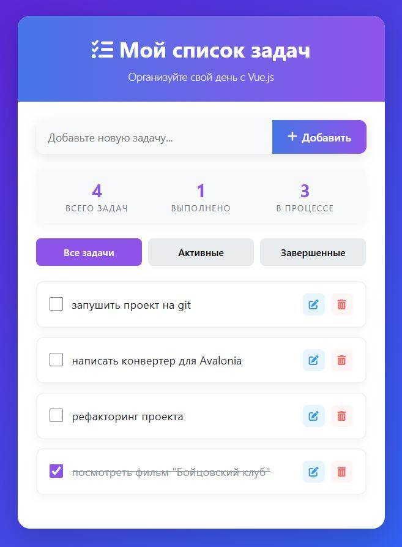
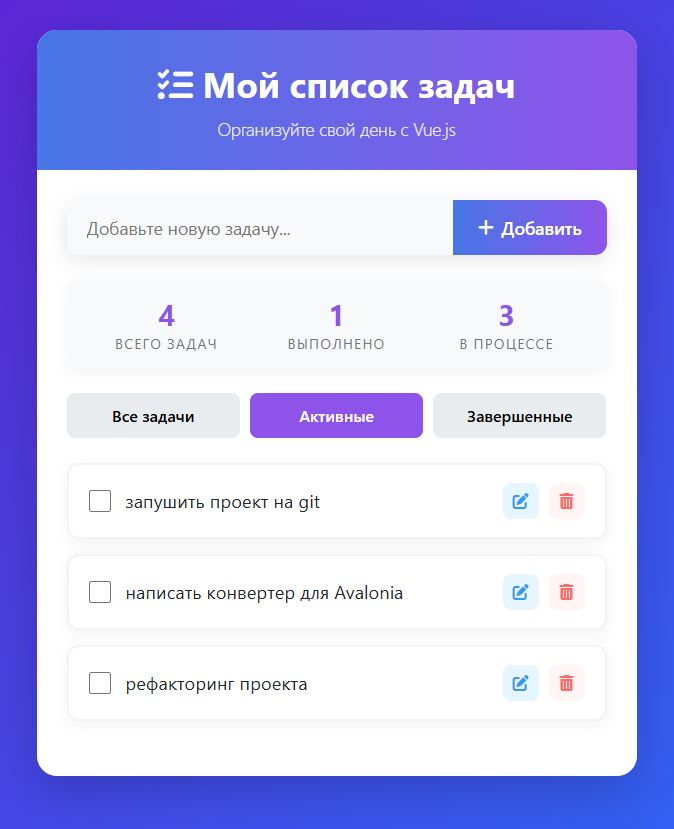
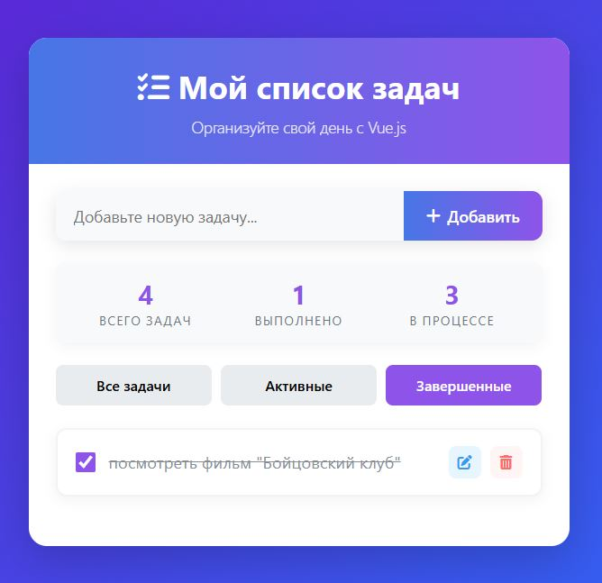

# 📝 __ToDo List на Vue.js__

Простое приложение "Список задач" (ToDo List), реализованное с использованием Vue.js 3 через CDN.

<div align="center">
  <br>
  <br>
  
</div>


## 🚀 __Функционал__

- ➕ Добавление новых задач через поле ввода (кнопка или Enter)
- 📋 Отображение списка всех задач
- ❌ Удаление задач по кнопке
- ⚠️ Валидация пустых задач
- 📱 Адаптивный дизайн

## 🧩 __Структура компонентов__

Приложение состоит из трех компонентов:

1. **`TaskInput`** - поле ввода новой задачи с кнопкой добавления
2. **`TaskList`** - контейнер для отображения списка задач
3. **`TaskItem`** - отдельный элемент списка с текстом задачи и кнопкой удаления

## 🛠️ Технологии

  
  
  

- Vue.js 3 (подключен через CDN)
- Чистый HTML/CSS (без препроцессоров)
- Composition API

## ⚡ __Установка и запуск__

📥 Клонируйте репозиторий (если есть):

   ```bash
   git clone https://github.com/D13young/ToDo_list.git
   ```
   🌐 Откройте index.html в браузере
